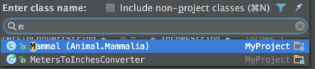
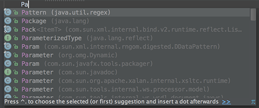
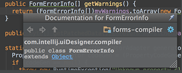
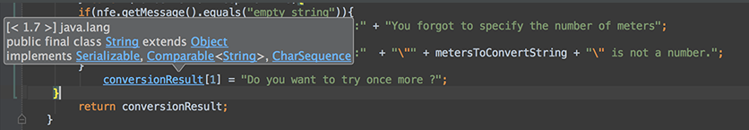
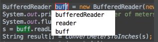
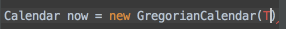
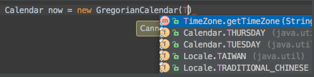
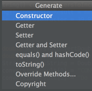
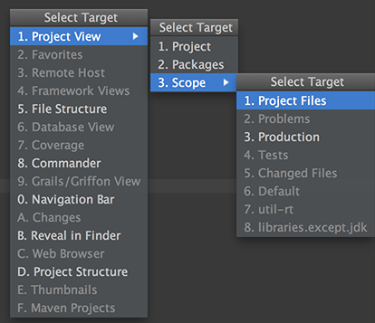

==Welcome to IntelliJ IDEA 14
You can quickly get familiar with the main features of the IDE by reading these tips. You may try out the features described in the tips while this dialog stays open on the screen. If you close the dialog, you can always get back to it from the Help | Tip of the Day main menu item.
==To open any class in the editor quickly, press Ctrl+N (Navigate | Class) and start typing the name of the class. Choose the class from a drop-down list that appears. 

	 

You can open any file in your project in a similar way by using Ctrl+Shift+N (Navigate | File) 

==The Code Completion feature lets you quickly complete different kinds of statements in the code. For example, start typing a class name and press Ctrl+空格 to complete it. When multiple choices are available, they are shown in the lookup list. 

	 

==You can quickly find all places where a particular class, method or variable is used in the whole project by positioning the caret at the symbol's name or at its usage in code and pressing Alt+F7 (Edit | Find | Find Usages in the popup menu). 

==To quickly see the documentation for a class or method at caret, press Ctrl+Q (View | Quick Documentation). 

	 

==To navigate to the declaration of a class, method or variable used somewhere in the code, position the caret at the usage and press Ctrl+B (Navigate | Declaration). You can also click the mouse on usages with the Ctrl key pressed to jump to declarations. 

	 

==You can quickly navigate in the currently edited file with Ctrl+F12 (Navigate | File Structure). 
It shows the list of members of the current class. Select an element you want to navigate to and press the Enter key or the F4 key. 
To easily locate an item in the list, just start typing its name. 
==You can easily rename your classes, methods and variables with automatic correction of all places where they are used. 
To try it, place the caret at the symbol you want to rename, and press Shift+F6 (Refactor | Rename). Type the new name in the popup window that appears, or select one of the suggested names, and press Enter. 

	 

==You may easily override methods of the base class by pressing Ctrl+O (Code | Override Methods). 
To implement methods of the interfaces that the current class implements (or of the abstract base class), use Ctrl+I (Code | Implement methods). 
==The SmartType code completion greatly helps to find methods and variables that are suitable in the current context, by analyzing the expected type of the whole expression. So doing, IntelliJ IDEA pinpoints the top five most suitable results and highlights them on the green background. For example, type 

	 

==and press Ctrl+Shift+空格: 

	 

The SmartType completion also works after the return keyword, in an assignment, in an argument list of a method call and other places. 
==When using Code Completion, you can accept the currently highlighted selection in the popup list with Tab key. 
Unlike accepting with the Enter key, the selected name will overwrite the rest of the name to the right of the caret. This can be especially useful for replacing one method or variable name with another. 
==Did you know that you can close tabs in the editor and the tool windows of IntelliJ IDEA without actually using the context menu commands? It is enough to point with your mouse cursor to a tab to be closed, and click the middle mouse button, or just use the Shift+click combination. 
==Using Alt+Insert (Code | Generate) in the editor, you can easily generate getter and setter methods for any fields of your class. 

	 

==To quickly select the currently edited element (class, file, method or field) in any view (Project view, Structure view or other), press Alt+F1. 

	 
