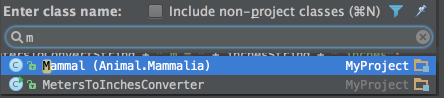
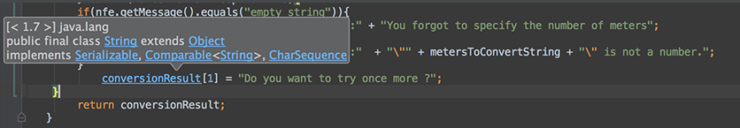
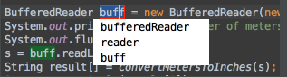
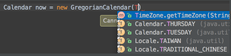

1.Welcome to IntelliJ IDEA 14
You can quickly get familiar with the main features of the IDE by reading these tips. You may try out the features described in the tips while this dialog stays open on the screen. If you close the dialog, you can always get back to it from the Help | Tip of the Day main menu item.

1.欢迎来到IntelliJ IDEA 14
通过阅读这些tips，你能够快速的熟悉本IDE的主要特性。你可边参考对话框中的描述，边进行操作。如果你关闭对话框，你仍然可以通过主菜单下的Help | Tip 选项找到它。

2.To open any class in the editor quickly, press Ctrl+N (Navigate | Class) and start typing the name of the class. Choose the class from a drop-down list that appears. 

2.想要快速的找到任何一个class类，按下Ctrl+N(Navigate | Class)键，然后输入class类的名字。从下拉列表中选择出现的那个类。

You can open any file in your project in a similar way by using Ctrl+Shift+N (Navigate | File) 

类似的，你可以通过Ctrl+Shift+N (Navigate | File) 打开项目中任意文件。

3.The Code Completion feature lets you quickly complete different kinds of statements in the code. For example, start typing a class name and press Ctrl+空格 to complete it. When multiple choices are available, they are shown in the lookup list. 

3.代码补全功能可以快速完成各种代码语句。例如，输入一个class类名称然后按下Crtl+空格去执行补全功能。多个选项可以选择会显示在下拉列表里。

4.You can quickly find all places where a particular class, method or variable is used in the whole project by positioning the caret at the symbol's name or at its usage in code and pressing Alt+F7 (Edit | Find | Find Usages in the popup menu). 

4.定位光标到符号或它被调用的地方，按下Alt+F7(Edit | Find | Find Usages in the popup menu)可以在整个项目中快速找到指定的class类、方法、或者属性。

5.To quickly see the documentation for a class or method at caret, press Ctrl+Q (View | Quick Documentation). 

5.光标处按下Ctrl+Q (View | Quick Documentation)可以快速查看类或方法的文档。

 

6.To navigate to the declaration of a class, method or variable used somewhere in the code, position the caret at the usage and press Ctrl+B (Navigate | Declaration). You can also click the mouse on usages with the Ctrl key pressed to jump to declarations. 

6.光标定位到符号调用处，按下Ctrl+B (Navigate | Declaration)，可以快速导航到class、方法或属性的声明处。也可以使用按住Ctrl+鼠标点击的方式跳转到声明处。

 

7.You can quickly navigate in the currently edited file with Ctrl+F12 (Navigate | File Structure). 
It shows the list of members of the current class. Select an element you want to navigate to and press the Enter key or the F4 key. 
To easily locate an item in the list, just start typing its name. 

7.在当前编辑文件中使用Ctrl+F12 (Navigate | File Structure)实现快速导航。这样可以显示当前class类的成员列表。选择想要直接到达的一个成员，按下回车或者F4就可以直接跳转。更简单的可以直接输入需要定位的成员的名称，直接定位。

8.You can easily rename your classes, methods and variables with automatic correction of all places where they are used. 
To try it, place the caret at the symbol you want to rename, and press Shift+F6 (Refactor | Rename). Type the new name in the popup window that appears, or select one of the suggested names, and press Enter. 

8.重命名一个class类、方法、属性可以自动联动修改项目中所有其被引用的地方。使用方法：定位光标到需要重命名的符号处，按下Shift+F6 (Refactor | Rename)。在弹出框输入新名字，或者选择一个推荐的名字，然后回车。

 

9.You may easily override methods of the base class by pressing Ctrl+O (Code | Override Methods). 
To implement methods of the interfaces that the current class implements (or of the abstract base class), use Ctrl+I (Code | Implement methods). 

9.按下Ctrl+O (Code | Override Methods)可以重写父类方法。使用Ctrl+I (Code | Implement methods)去实现接口的方法。

10.The SmartType code completion greatly helps to find methods and variables that are suitable in the current context, by analyzing the expected type of the whole expression. So doing, IntelliJ IDEA pinpoints the top five most suitable results and highlights them on the green background. For example, type 

10.SmartType代码自动完成能够通过分析整个表达式期望的类型，找到当前内容匹配的方法和类。IntelliJ IDEA能够精确匹配最匹配的前五个结果同时绿底色高亮它们。比如：输入

 

and press Ctrl+Shift+空格: 

然后按下Ctrl+Shift+空格: 

 

   The SmartType completion also works after the return keyword, in an assignment, in an argument list of a method call and other places. 

   SmartType自动完成也可以完成return关键字，调用方法的参数列表等其他地方。
   
11.When using Code Completion, you can accept the currently highlighted selection in the popup list with Tab key. 
Unlike accepting with the Enter key, the selected name will overwrite the rest of the name to the right of the caret. This can be especially useful for replacing one method or variable name with another. 

11.使用代码补全功能，Tab键可以确认选择弹出列表中当前高亮选择的选项。不像使用Entry键，按下Tab键会把光标邮编的字符覆盖掉。他可以将方法或属性替换成另外一个。

12.Did you know that you can close tabs in the editor and the tool windows of IntelliJ IDEA without actually using the context menu commands? It is enough to point with your mouse cursor to a tab to be closed, and click the middle mouse button, or just use the Shift+click combination. 

12.可以将鼠标移动到需要关闭的tab页或者工具窗口，点击鼠标中键或者Shift+单击组合键，关闭tab也或者工具窗口。

13.Using Alt+Insert (Code | Generate) in the editor, you can easily generate getter and setter methods for any fields of your class. 

13.编辑窗口中使用Alt+Insert (Code | Generate)，可以生成通用的getter、setter方法。

 

15.To quickly select the currently edited element (class, file, method or field) in any view (Project view, Structure view or other), press Alt+F1. 

15.Alt+F1可以快速在任意视图中 (项目视图、结构视图或其他)选中一个元素(class类、文件、方法或者属性)

 
