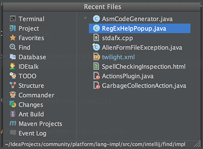
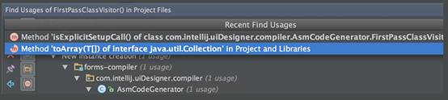
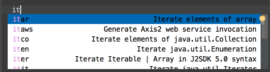
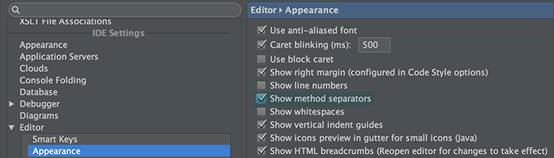
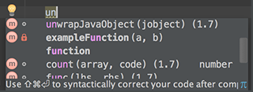
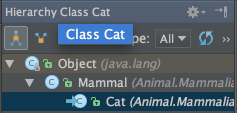
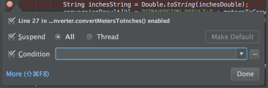

<<<<<<< HEAD

31.使用Ctrl+Shift+F7(或菜单中Edit | Find | Highlight Usages in File)来快速的将当前文件中的变量高亮显示。
使用Alt+Shift+N和Alt+N来在高亮变量之间移动。
使用Esc键可以移除高亮显示。

32.使用Code | Reformat Code 可以将你的代码按照定义的代码样式(File | Settings | Code Style)来重新进行格式化。
你也可以通过Code | Optimize Imports 来自动优化import的文件(移除没有用到的import文件等)。通过File | Settings | Code Style | Imports 可以进行更多的相关设置。

33.通过菜单中的Local History | Show History 可以查看文件中的本地修改历史。你可以在不同的历史版本查看，进行差异比较或是回滚到之前的任何版本。
在该菜单选项中也可以以目录的形式来查看历史修改。用好这个功能不会让你丢失任何代码的！ 

34.使用Alt+Q (View | Context Info)可以不用滚动就查看到当前方法的说明。 

35.Ctrl+E (View | Recent Files)会弹出最近访问过文件的列表。选中想要打开的文件按下Enter就可以了。 

 
除了能查看最近访问的文件外，你可以查看最近执行的搜索。在选中Find工具的窗口情况下，同样可以在使用Ctrl+E显示历史搜索，然后就可以在Recent Find Usages中选择的想要的搜索了。

 
36.使用F2/Shift+F2快捷键可以在高亮的语法错误间移动。
使用Ctrl+Alt+向上箭头/Ctrl+Alt+向下箭头快捷键可以在编译错误信息或搜索结果之间移动。
在validation side bar / marker bar上单击右键，选中“Go to high priority problems only”可以跳过warning（警告）消息

37.如果你忘记语法关键词的话，可以使用Ctrl+J来显示所有可用的代码补全。比如，输入it然后使用Ctrl+J就会如下图所示。

38.如果想显示方法之间的分隔符，可以在Editor中选择Appearance子页面，然后勾选Show method separator复选框来设置。 

39.当使用“基本代码补全”(Ctrl+空格)功能时,会显示所有包含该字符的标识符。

 
40.使用Alt+向上箭头 和 Alt+向下箭头 来快速的在编辑页面的方法之间切换。

41.使用Ctrl+Shift+J可以将两行代码合并为一行，并且会按照你的代码样式来去除无用的空格。 

42.使用Refactor | Copy 来复制与选中类。某些情况下这会很有帮助，例如，当你想创建一个虽然与存在的类有很多相似之处但是却不会把他们共有父类中的一些方法加进去的类的时候。

43.使用Ctrl+Shift+V快捷键来选择并插入多个最近粘贴板中的文本

44.使用Ctrl+H (Navigate | Type Hierarchy)来查看所选中类的继承结构。同样，你也可以调出编辑器右侧的继承视图(hierarchy view)来查看当前编辑的类的继承结构。

45.在断点标签（在编辑代码左侧的一栏中）上右键调出菜单，在这个菜单里可以快速的开启/关闭断点或者更改相关属性。 

=======
31.	Use Ctrl+Shift+F7 (Edit | Find | Highlight Usages in File) to quickly highlight usages of some variable in the current file. 
Use Alt+Shift+N and Alt+N keys to navigate through highlighted usages. 
Press Esc to remove highlighting. 
32.	Use Code | Reformat Code to reformat code according to your code style preferences (File | Settings | Code Style). 
You can also use Code | Optimize Imports to automatically optimize imports (remove unused imports, etc.). To access the corresponding settings, use File | Settings | Code Style | Imports. 
33.	To see your local history of changes in a file, invoke Local History | Show History from the context menu. You can navigate through different file versions, see the differences and roll back to any previous version. 
Use the same context menu item to see the history of changes on a directory. You will never lose any code with this feature! 
34.	Press Alt+Q (View | Context Info) to see the declaration of the current method without the need to scroll to it. 
35.	Ctrl+E (View | Recent Files) brings a popup list of the recently visited files. Choose the desired file and press Enter to open it. 
 
Besides recent files, you can bring up results of the usage searches you have performed recently. To do that, use the same Ctrl+E shortcut with the Find tool window having the focus, and select the desired find usages result from the Recent Find Usages popup. 
 
36.	Use F2/Shift+F2 keys to jump between highlighted syntax errors. 
Use Ctrl+Alt+向上箭头/Ctrl+Alt+向下箭头 shortcuts to jump between compiler error messages or search operation results. 
To skip warnings right click on the validation side bar / marker bar and choose Go to high priority problems only. 
37.	Use Ctrl+J to complete any valid Live Template abbreviation if you don't remember it. For example, type it and press Ctrl+J to see what happens. 
 
38.	To show separator lines between methods in the editor, open the editor settings and select the Show method separators check box in the Appearance page. 
 
39.	When using basic code completion (Ctrl+空格), type any characters that exist anywhere in an identifier. 
 
40.	Use Alt+向上箭头 and Alt+向下箭头 keys to quickly move between methods in the editor. 
41.	Ctrl+Shift+J shortcut joins two lines into one and removes unnecessary space to match your code style. 
42.	Use Refactor | Copy to create a class which is a copy of the selected class. This can be useful, for example, when you need to create a class which has much in common with some existing class and it's not feasible to put the shared functionality in a common superclass. 
43.	Use the Ctrl+Shift+V shortcut to choose and insert recent clipboard contents into the text. 
44.	To see the inheritance hierarchy for a selected class, press Ctrl+H (Navigate | Type Hierarchy). You can also invoke the hierarchy view right from the editor to see the hierarchy for the currently edited class. 
 
45.	Right-clicking on a breakpoint marker (on the bar to the left from the text) invokes the speedmenu where you can quickly enable/disable the breakpoint or adjust its properties. 
 
>>>>>>> refs/remotes/origin/master
