46.To easily evaluate the value of any expression while debugging the program, select its text in the editor (you may press a Ctrl+W a few times to efficiently perform this operation) and press Alt+F8.

47.To quickly evaluate the value of any expression while debugging the program, hold Alt and click this expression to see its value and calculate it, call a method, etc.

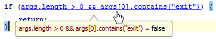

48.Use Basic Completion (Ctrl+空格) for completing words in text and comments in files of many different types.
All the words from the current file that start with the typed prefix will appear in the lookup list.

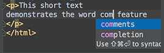

49.The shortcuts such as Ctrl+Q (View | Quick Documentation), Ctrl+P (View | Parameter Info), Ctrl+B (Navigate | Declaration) and others can be used not only in the editor but in the code completion popup list as well.

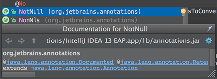

50.When using Code Completion, you can accept the currently highlighted selection in the popup list with the period character (.), comma (,), semicolon (;), space and other characters.
The selected name is automatically entered in the editor followed by the entered character.

51.To help you learn the purpose of each item in the main menu, its short description is shown in the status bar at the bottom of the application frame when you position the mouse pointer over this item.

52.For the pattern search in the Go to Class, Go to Symbol and Go to File pop-up frames, use * and space symbols.
*stands for any symbol.
Space at the end means the end of a pattern, and the preceding string will be considered not just a prefix but a whole pattern. The list of the suggested names will be reduced accordingly.

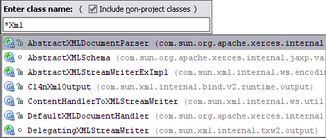

53.When you invoke the Move refactoring (F6) on an inner class that is declared static, you are provided with an option to either make it a top-level class, or move it to another class.

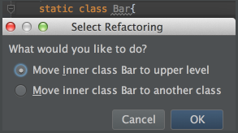

54.You can use the Extract Variable refactoring even on incomplete statements. Just select the necessary block in the editor and press Ctrl+Alt+V.

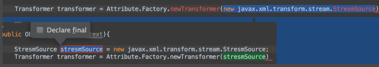

55.To open any particular method or field in the editor quickly, press Ctrl+Alt+Shift+N (Navigate | Symbol) and start typing its name.
Choose symbol from the drop-down list that appears.

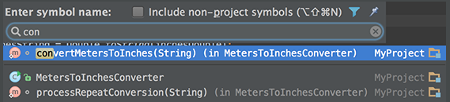

56.Use Alt+Shift+C to quickly review your recent changes to the project.

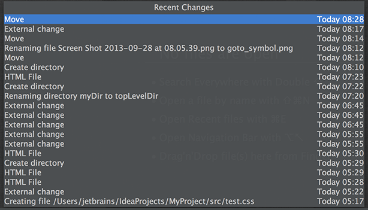

57.Use Basic Completion (Ctrl+空格) within HTML, CSS and other files, for completing image file names.

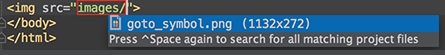

58.You can start referring to an Ant property or target even if it is not defined yet. An intention action feature will suggest you to automatically create the necessary tag, without the need for you to leave your current editing location.

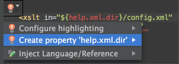

59.With a single keystroke, you can apply another code style/coloring scheme or keymap right from the editor. Just press Ctrl+后引号 (View | Quick Switch Scheme), to specify the scheme you want to change.

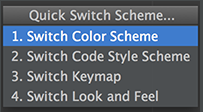

60.Use Ctrl+Shift+Enter to complete a current statement such as if, do-while, try-catch, return (or a method call) into a syntactically correct construct (e.g. add curly braces).

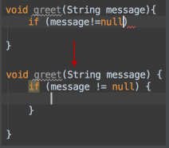
