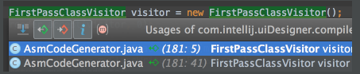
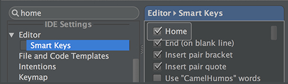
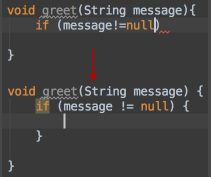
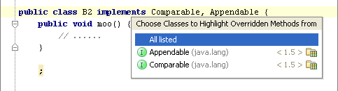
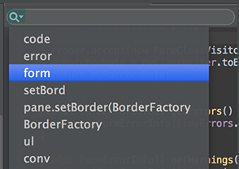
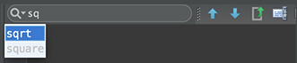
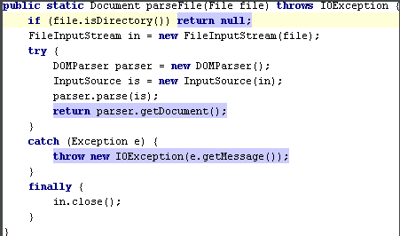
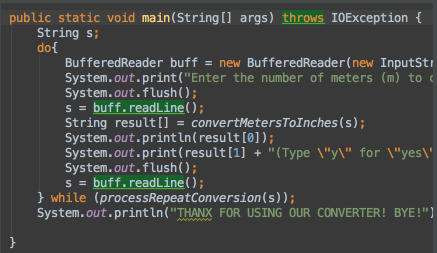
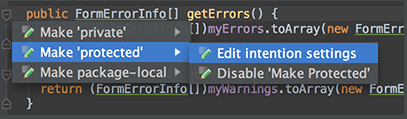
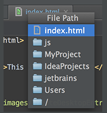

76.You can quickly open a Maven project by selecting a pom.xml file in the File | Open dialog. The corresponding Maven project is imported with default settings, without launching the wizard.

76.你可以点击File | Open 打开一个对话框，然后选择一个pom.xml文件来快速打开一个Maven项目。相应的项目会以默认的配置被导入，不会启动Maven项目配置时引导界面。

77.If you don't want to commit some of your changes to the repository, you can set them aside for a while, by moving to a separate changelist, or by putting them to a shelf. Select such file in the Local tab of the Changes tool window, and on the context menu choose Move to Another Changelist, or Shelve Changes.

77.如果你不想提交一些修改记录到你的本地仓库，你通过移动它们到一个单独的变更清单里或放置到一个临时搁架上暂时把它们搁置到一边。在Version Control 标签里的Local Changes窗口下选中暂不提交的文件，然后在上下文菜单中点击提示为Move to Another Changelist, or Shelve Changes的按钮，或者按快捷键F6.

78.You can quickly open an Eclipse project by selecting a .classpath or .project file in the File | Open dialog. The corresponding Eclipse project is imported with default settings, without launching the wizard.

78.你可以点击File | Open 打开一个对话框，然后选择一个.classpath或.project文件来快速打卡一个Eclipse项目。相应的Eclipse项目会以默认的配置被导入，不会启动引导界面。

79.You can bring forward the list of all usages of a class, method or variable across the whole project, and quickly jump to the selected usage. To do that, place the caret at the symbol's name or at its usage in code and press Ctrl+Alt+F7 (Edit | Find | Show Usages in the main menu), scroll the list and click the desired usage.

79.你可以把一个类，方法或变量在整个工程中所有被用到的地方都可以提前列出来，然后可以快速去到你想去的地方。你只需把光标放在你的变量或方法名称或类名称上，然后按下Ctrl + Alt +F7(或者点击Edit | Find | Show Usages), 最后在列表里找你想要的结果。

80.To quickly find a menu command or toolbar action, you do not need to look through the menus. Just press Ctrl+Shift+A (Help | Find Action on the main menu) and start typing the name of the action. Choose the desired action from the suggestion list. 

80.想要快速找到一个菜单或工具栏里的操作，你可以不用浏览每一个菜单的功能，只需按下Ctrl + Shift + A(或在主菜单栏里点击Help | Find Action), 然后输入操作名称就可以在建议的结果列表里选择预期操作。

81.To quickly find and run an inspection, press Ctrl+Alt+Shift+I and start typing the name of the inspection or its group. Choose the desired inspection from the suggestion list and then specify the desired scope. 

81.想要快速运行一个代码审查，你可以按Ctrl + Alt + Shift + I, 并输入一个名称。然后选择一个码审查的类型，并指定审查的范围即可。

82.You can quickly find a setting you need in the Settings/Preferences dialog, without browsing through the numerous options. Just type some characters that, in your opinion, exist in the option description, and the list of settings will reduce to the matching ones. Select the desired entry, and see the setting that contains the entered characters highlighted:

82.你可以在Setting/Preferences里的搜索框中输入选项的名称来快速定位到目标处，然后你输入的名字会以高亮的形式显示。

83.You can create code constructs using statement completion. Start typing a method declaration or a statement, and press Ctrl+Shift+Enter after the opening parenthesis. The braces are created, with the caret placed inside: 

83.你可以使用语句完成功能来编写代码。声明方法或者语句块时, 按下Ctrl + Shift + Enter，就可以自动补齐括号，光标并会被置于方法体中。

84.You can view all methods of the implemented interfaces in a class, if you place the caret at the implements keyword in the class declaration, press Ctrl+Shift+F7, and select the desired interface from the list: 

84.如果你把光标放在类声明处的implements关键字上，然后按下Ctrl + Shift + F7，你可以查看所有的接口实现方法。

85.When searching for a text string in a file, use recent history: with the search pane already open, click the down arrow to show the list of recent entries. 

85.当你在一个文件里查找文本时，在查找面板中的输入框旁点击那个向下的箭头就可以看到最近的查找项。

 
86.When you are finding text in the current file (Ctrl+F), you don't need to type the whole search string: Basic Code Completion is available in the search field. Start typing, press Ctrl+空格, and select the desired string from the suggestion list. 

在当前文件里查找文本时，不需要输入全部的字符，输入部分字符时，按Ctrl + 空格，然后选择目标即可。

87.To view all exit points of a method, place the caret at one of them, e.g. the return statement, and press Ctrl+Shift+F7: 
查看一个方法所有的出口，把光标放到其中一处,比如放到一个返回语句上，然后按Ctrl + Shift + F7.

 
88.You can view all statements within the method where certain exceptions can be caught. Just place the caret at the throws keyword in a method declaration, press Ctrl+Shift+F7 and select the desired exception class from the list. This will also work for try and catch. 

88.你可以在方法中查看所有可能抛异常的代码，只需把光标放在方法声明中的throws关键字上，按Ctrl + Shift + F7，然后选择定位目标异常类。当然，这同样也适用于try catch代码块。

 
89.When you press Alt+Enter to invoke a quick fix or intention action, press the right arrow key to reveal the list of additional options. 
Depending on the context, you can choose to disable inspection, fix all problems, change inspection profile, etc. 

89.当你用Alt + Enter执行快速修复或缩进代码时，可以按右箭头键来显示附加的选项，然后可以执行禁用代码审查，修复所有问题，更改审查配置文件等操作。

 
90.Ctrl+Click (on Windows) or Cmd+Click (on MacOS) a tab in the editor to navigate to any part of the file path. Select the necessary element in the drop-down, and the corresponding file path opens in an external browser (e.g., in the Explorer, if your OS is Windows). 

按Ctrl键(Windows操作系统）或按Cmd(MacOs系统）并点击编辑栏上的任一标签并选择相应的目录，然后资源管理器就会打开相应的目录。

