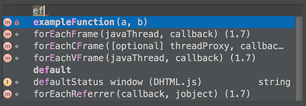
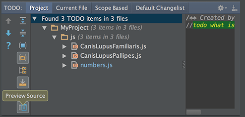
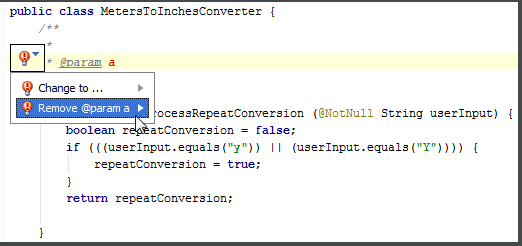
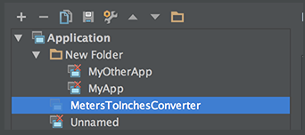
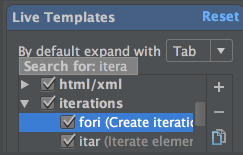
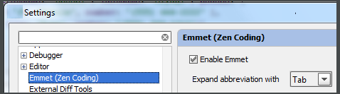

106.To compare two directories, select one or both of them in the Project view and press Ctrl+D. 
106.需要比较两个文件路径，在project视图下，选择其中一个（译者注：按下快捷键后，会弹出选择窗口，选择另一个文件路径）或者两个同时选中，然后按下Ctrl+D.
（译者注：这个快捷键也可以直接比较两个文件，而不是原版Tips特指的“To compare two directories”）
107.To compare two jar files, select one or both of them in the Project view and press Ctrl+D. 
107.需要比较两个jar文件，在project视图下，选择其中一个（译者注：按下快捷键后，会弹出选择窗口，选择另一个文件路径）或者两个同时选中，然后按下Ctrl+D.
（译者注：这个快捷键可以比较反编译后的jar文件内容）
108.If you need more workspace, you can hide the tool windows bars: click  in the lower left corner. 
If necessary, you can show the tool window buttons just for a moment. To do that, press the key Alt (for Windows/*nix) or Command (for Mac) twice and keep it down. While the key is pressed, the tool window buttons are visible. 
108.点击左下角图标隐藏工具栏，以获得更多工作空间区域。 
    如果需要的话，你可能需要工具栏按钮临时显示一下，可以这样做，双击Alt键 (for Windows/*nix) 或者 Command键 (for Mac) 然后保持不要松开，这时候工具栏就会显示出来.
109.	You can exclude any file from your project. As a result, such a file will be ignored by indexing, inspection and code completion. 
In the Project tool window, select the file you want to ignore, and choose Mark as plain text in its context menu. 
If necessary, you can always return the file to its original type using the Mark as <file type> context menu command. 
109.你可以排除一些文件，这样这些文件会被indexing、检查、代码补全所忽略.
在工程窗口，选择你想要要忽略的文件，然后在右键菜单中选择 Mark as plain text.
如果需要的话，可以选择Mark as <file type> context菜单命令将文件还原.
（译者注：Idea15已经去掉此功能？详见[IntelliJ IDEA 使一些文件不参与代码提示](http://jingyan.baidu.com/article/5552ef47d8e690518efbc940.html)侵删）
110.When using basic code completion (Ctrl+空格), you don't need to type upper-case letters in CamelHump names. It is enough to type the initial letters of the camel names in lower case, and they will be smartly recognized. 
使用代码补全功能 (Ctrl+空格), 你不需要按照驼峰是命名规则输入大写字符.直接输入小写字符就足够了，Idea可以很聪明的识别这些.
 
 
111.The keyboard shortcut Ctrl+K enables you to quickly invoke the Commit Changes dialog. 
This dialog shows all modifications in project, gives summary information of file status and suggests improvements before check-in. 
112.It is very easy to toggle between find and replace functionality. 
When you perform search and replace in a file, pressing Ctrl+F shows the search pane. Pressing Ctrl+R adds field, where you can type the replace string. 
While in the Find in Path dialog, you can switch to replace by pressing Ctrl+Shift+R. Same way, press Ctrl+Shift+F to hide the Replace with field, and switch to mere search. 
113.If you are working on a large project, with numerous TODO items, filter them by scopes. 
Use the Scope-Based tab in the TODO tool window to show only those items that pertain to the scope of interest. 

 
 
114.TODO tool window lets you preview each of the encountered TODO items - just click the preview button on the toolbar. 
 
 
 
115.If a method signature has been changed, IntelliJ IDEA highlights the tags that ran out of sync with the documentation comment and suggests a quick fix: 

 
 
116.When working with a lengthy list of tasks, you don't need to delete them one by one. Select several tasks, using Shift or Control/Command keys, click the right arrow, and then click Remove. 

 
 
117.If there are too many run/debug configurations of the same type, you can group them into folders, and thus distinguish them visually. 

 
 
118.In the Live Templates settings, use speed search to find templates with certain text in the template abbreviation, body or description. 
Start typing the desired text, and the list of available templates will shrink to show matching templates only: 
  
  
  
119.You can avoid escaping backslashes in your regular expressions. Start typing a regular expression, then press Alt+Enter and choose Edit RegExp. The regular expression opens in a separate tab in the editor, where you can type backslashes as is. 
All changes are synchronized with the original regular expression, and escapes are presented automatically. When ready, just press Esc to close the regular expression editor. 
 
  
  
120.Speed up HTML, XML or CSS development with Emmet. 
Enable this framework in the Emmet(Zen Coding) page of the Settings dialog: 

 
 
